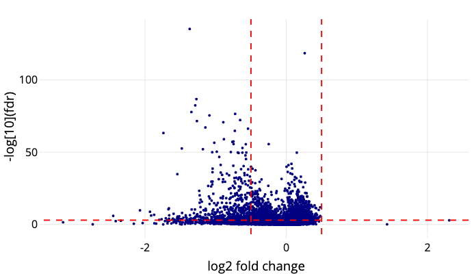
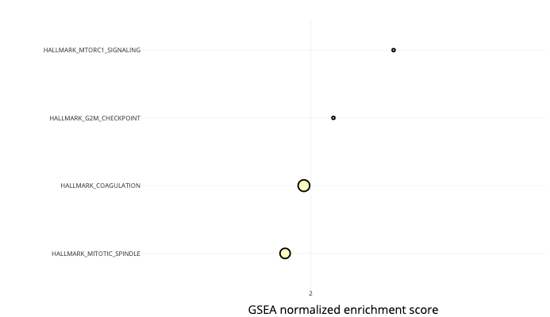

# PathwayExplorer

This is an app to provide a tool to explore the results of a differential expression analysis and the downstream pathway analysis.

It requires:

1. Results of using DESeq2 to test for differential expression
2. A `gmt` symbol file obtained from [MSigDB](https://www.gsea-msigdb.org/gsea/msigdb/)

Then the app will show:

1. A volcano plot to explore the DE results. Clicking here will show whether the gene is one of the leading genes in a pathway

2. A dot plot to explore the pathway analysis results. Clicking here will show in the volcano plot which genes are in the pathway and which among them are determined as leading edges by gsea.

## Bibliography

### DESeq2

Love, Michael I., Wolfgang Huber, and Simon Anders. 2014. “Moderated Estimation of Fold Change and Dispersion for RNA-Seq Data with DESeq2.” Genome Biology 15 (12): 550.

### fgsea

Korotkevich, Gennady, Vladimir Sukhov, Nikolay Budin, Boris Shpak, Maxim N. Artyomov, and Alexey Sergushichev. 2021. “Fast Gene Set Enrichment Analysis.” bioRxiv. https://doi.org/10.1101/060012.